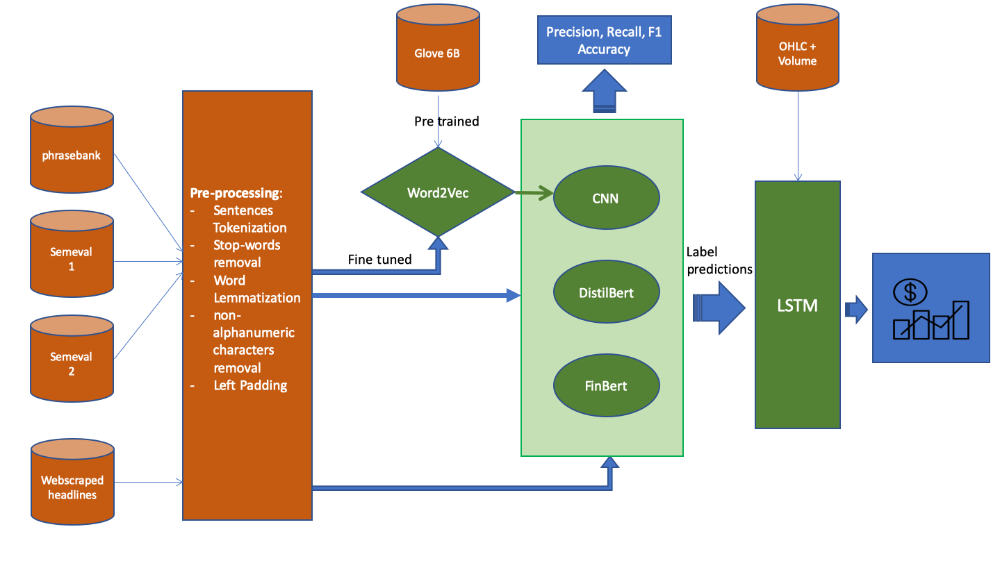

# Project description
LongShort_2.0 is a thesis repo tasked with proving if the introduction of Sentiment Analysis in trading strategies with Deep Learning configurations leads to better financial results than a simple **Buy & Hold (B&H)** approach 📈. The trading approach to be compared against the benchmark (B&H) is the widely known in the finance industry **Long Short strategy**. This involves buying or selling an asset based on a signal that for the thesis' sake will be the comparison between the price forecast and the previous closing price of the stock. All the custom strategies will use a LSTM neural network to do price forecasting, while different models will be used for analyzing sentiment, namely two configurations of the Transformer BERT (DistilBERT and FinBERT) and a CNN.

## Pipeline 🏁
This below is a representation of the project workflow, where the orange area represents the part regarding the Data Gathering process and pre-processing, the green one shows the models used in the thesis, whereas the blue one is about the final results of the Sentiment Analysis classificators and the price forecasts. 



## How the Repo works 💊
To obtain the final results two steps must be executed:
* The first one considers the execution of the *main.py* script where the data is prepared for training and testing the models. All the datasets are then stored inside the ./GPU_Server_Run/Input_Data/ folder where the models will extract the input information;
* Secondly, the *GPU_Server_Run* folder contains the models' scripts needed to achieve the goal of the thesis. These are very powerful and heavy architectures that require many hours of training therefore it is advisable to run all of them in folder ./GPU_Server_Run/Models/ and on a GPU server.

Regarding the latter, it has been proven as working using an open source file transfer protocol software like FileZilla to upload the entire *GPU_Server_Run* folder on the server and PuTTY as terminal emulator to run the scripts after changing directory to ./GPU_Server_Run/Models/

The server specifics can be found in the *server_info.txt* file, while *requirements.txt* presents the roster of all the Python packages used.

The outputs of the whole project can be found in the folder path ./GPU_Server_Run/Output/ with each respective studied model.

## Caveats ⚠️
There are some points that require attention, for instance the need of creating an account and an API token on [HuggingFace](https://huggingface.co/). The user access token will need to be assigned to the token variable in the *Transformers_classif_task.py* and *Transformers_regress_task.py* scripts.

To train the models the "execute permission" to run the Python scripts is needed and this can be achieved through this bash code:
```bash
chmod +x file_name.py
```
After this, the execution is quite simple and can be achieved by running this command in the background so that even if the connection with the server is lost the training will not stop:
```bash
nohup ./path/to/file/file_name.py  > output.log 2>&1 &
```
In this way the output will be written on a log file called *output.log*.

Replacing file_name and the path with the right model script name and folder path.

Given the file size of the initial Glove.6B dataset file, this has been sliced into different chunks to upload this data on GitHub as well. As a matter of fact, GitHub has a file size limit of 100 MB and the file was around 10 times bigger. This process has been performed in *file_slicing.py* . All the chunks are automatically recombined in the CNN scripts.

For any questions, errors, or suggestions, feel free to connect with me on [LinkedIn](https://www.linkedin.com/in/nicol%C3%B2-di-giovanni/) 📬.

